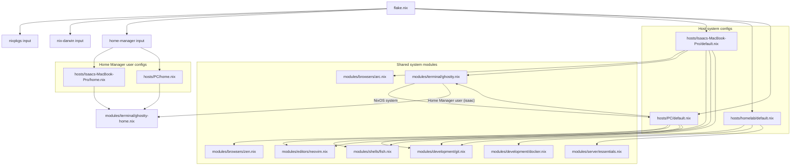

# Multi-Machine Nix Configuration

<!-- ======================================================================= -->
<!-- This README provides setup instructions and usage documentation for     -->
<!-- managing multiple machines with Nix flakes.                             -->
<!-- ======================================================================= -->

## Overview

<!-- This section describes what this repository contains and its purpose -->

This repository contains declarative system configurations for multiple machines:

| Machine              | Platform       | Type       | Description                    |
| -------------------- | -------------- | ---------- | ------------------------------ |
| `Isaacs-MacBook-Pro` | aarch64-darwin | nix-darwin | macOS development workstation  |
| `homelab`            | x86_64-linux   | NixOS      | Headless Linux server (no GUI) |
| `PC`                 | x86_64-linux   | Ubuntu     | Linux desktop with gaming      |

## Quick start (bootstrap script)

Install Nix and enable flakes first (see [macOS](#macos) or [Linux (NixOS)](#linux-nixos)), then run:

```bash
bash <(curl -fsSL https://github.com/isaaclins/configuration/raw/main/scripts/bootstrap.sh)
```

The script will ask for confirmation before applying. On Linux it will prompt you to choose **PC** (desktop) or **homelab** (server).

## Repository Structure

<!-- This section explains the directory layout and what each folder contains -->

```
configurations/
├── flake.nix                    # Root flake - entry point for all configurations
├── flake.lock                   # Locked dependency versions for reproducibility
├── README.md                    # This documentation file
│
├── modules/                     # Shared modules (hosts import only what they need)
│   ├── browsers/
│   │   ├── arc.nix              # Arc browser (macOS only)
│   │   └── zen.nix              # Zen browser (Linux only)
│   ├── terminal/
│   │   └── ghostty.nix          # Ghostty terminal emulator
│   ├── editors/
│   │   └── neovim.nix           # Neovim text editor
│   ├── shells/
│   │   └── fish.nix             # Fish shell with zoxide
│   ├── development/
│   │   ├── git.nix              # Git version control + GitHub CLI
│   │   └── docker.nix           # Docker containerization
│   └── server/
│       └── essentials.nix       # Server monitoring and tools
│
└── hosts/                       # Per-machine configurations
    ├── Isaacs-MacBook-Pro/      # macOS workstation
    │   └── default.nix
    ├── homelab/                 # Linux server (headless)
    │   └── default.nix
    └── PC/                      # Linux desktop
        └── default.nix
```

## Setup (copy-paste by OS)

### macOS

1. Install Nix (then open a **new terminal**):

   ```bash
   curl -L https://nixos.org/nix/install | sh
   ```

2. Enable flakes:

   ```bash
   mkdir -p ~/.config/nix && echo "experimental-features = nix-command flakes" >> ~/.config/nix/nix.conf
   ```

3. Clone this repo and apply the macOS configuration (first time):

   ```bash
   git clone https://github.com/isaaclins/configuration.git ~/.config/nix/configuration
   cd ~/.config/nix/configuration
   sudo nix run nix-darwin --extra-experimental-features "nix-command flakes" -- switch --flake .#Isaacs-MacBook-Pro
   ```

4. Later: update and re-apply:

   ```bash
   cd ~/.config/nix/configuration && git pull --ff-only
   sudo darwin-rebuild switch --flake .#Isaacs-MacBook-Pro
   ```

### Linux (NixOS)

This repo provides two NixOS profiles: **homelab** (server) and **PC** (desktop). You must already be running NixOS.

1. Enable flakes. Add this line inside the `{ config, pkgs, ... }:` block in `/etc/nixos/configuration.nix`:

   ```nix
   nix.settings.experimental-features = [ "nix-command" "flakes" ];
   ```

   Then run:

   ```bash
   sudo nixos-rebuild switch
   ```

2. Clone this repo and apply a host. For **server (homelab)**:

   ```bash
   git clone https://github.com/isaaclins/configuration.git ~/.config/nix/configuration
   cd ~/.config/nix/configuration
   sudo nixos-rebuild switch --flake .#homelab
   ```

   For **desktop (PC)**:

   ```bash
   git clone https://github.com/isaaclins/configuration.git ~/.config/nix/configuration
   cd ~/.config/nix/configuration
   sudo nixos-rebuild switch --flake .#PC
   ```

3. Later: update and re-apply (use `homelab` or `PC` as your host):

   ```bash
   cd ~/.config/nix/configuration && git pull --ff-only
   sudo nixos-rebuild switch --flake .#homelab
   ```

   Or for PC:

   ```bash
   cd ~/.config/nix/configuration && git pull --ff-only
   sudo nixos-rebuild switch --flake .#PC
   ```

**Primary user:** The config creates and uses one primary user (default `isaaclins`). To use a different username, set it when building:

```bash
NIX_CONFIG_PRIMARY_USER=yourusername sudo nixos-rebuild switch --flake .#PC
```

(Works for homelab, PC, and macOS with `darwin-rebuild`.) If only root exists, that user is created by the config.

## Deployment (manual, without bootstrap script)

Clone or update the repo yourself, then run the apply command for your OS.

**macOS:**

```bash
cd ~/.config/nix/configuration
git pull --ff-only
sudo darwin-rebuild switch --flake .#Isaacs-MacBook-Pro
```

**Linux (homelab):**

```bash
cd ~/.config/nix/configuration
git pull --ff-only
sudo nixos-rebuild switch --flake .#homelab
```

**Linux (PC):**

```bash
cd ~/.config/nix/configuration
git pull --ff-only
sudo nixos-rebuild switch --flake .#PC
```

## Adding a New Machine

<!-- This section provides a guide for adding additional machines -->

1. **Create a host directory**:

   ```bash
   # Create the directory for your new machine
   mkdir -p hosts/<hostname>
   ```

2. **Create the configuration file** (`hosts/<hostname>/default.nix`):

   ```nix
   # Example structure for a new host configuration
   { config, pkgs, lib, ... }:
   {
     imports = [
       # Import only the modules this machine needs
       ../../modules/shells/fish.nix
       ../../modules/editors/neovim.nix
     ];

     # Host-specific settings go here
   }
   ```

3. **Add to flake.nix**:

   ```nix
   # For macOS, add to darwinConfigurations:
   "<hostname>" = nix-darwin.lib.darwinSystem {
     system = "aarch64-darwin";  # or "x86_64-darwin" for Intel Macs
     modules = [ ./hosts/<hostname>/default.nix ];
   };

   # For Linux, add to nixosConfigurations:
   "<hostname>" = nixpkgs.lib.nixosSystem {
     system = "x86_64-linux";
     modules = [ ./hosts/<hostname>/default.nix ];
   };
   ```

4. **Deploy**:

   ```bash
   # For macOS
   sudo darwin-rebuild switch --flake .#<hostname>

   # For Linux
   sudo nixos-rebuild switch --flake .#<hostname>
   ```

## Module System

<!-- This section explains how the modular design works -->

### Design Philosophy

- **Modules are optional**: Each host imports only what it needs
- **No bloat**: Server doesn't get desktop software
- **Clear dependencies**: Each host's `default.nix` shows exactly what it uses
- **Easy customization**: Add/remove features by adding/removing imports

### Available Modules

| Module                   | Description         | Used By                |
| ------------------------ | ------------------- | ---------------------- |
| `browsers/arc.nix`       | Arc browser         | Isaacs-MacBook-Pro     |
| `browsers/zen.nix`       | Zen browser         | PC                     |
| `terminal/ghostty.nix`   | Ghostty terminal    | Isaacs-MacBook-Pro, PC |
| `editors/neovim.nix`     | Neovim editor       | Isaacs-MacBook-Pro, PC |
| `shells/fish.nix`        | Fish shell + zoxide | Isaacs-MacBook-Pro, PC |
| `development/git.nix`    | Git + GitHub CLI    | All machines           |
| `development/docker.nix` | Docker containers   | homelab                |
| `server/essentials.nix`  | Server tools        | homelab                |

### Configuration Architecture



## Updating

<!-- This section explains how to keep configurations up to date -->

### Update Flake Inputs

```bash
# Update all inputs to their latest versions
# This modifies flake.lock with new commit hashes
nix flake update

# Update only a specific input (e.g., nixpkgs)
nix flake lock --update-input nixpkgs
```

### Apply Updates

```bash
# After updating, rebuild your system
# macOS:
sudo darwin-rebuild switch --flake .#Isaacs-MacBook-Pro

# Linux:
sudo nixos-rebuild switch --flake .#<hostname>
```

## Versioned Snapshots with GitHub Releases

<!-- This section explains how to use tags/Releases as frozen snapshots -->

### Why use releases?

- **Reproducible snapshots**: Each tag + `flake.lock` is a frozen view of all hosts.
- **Safe rollbacks**: You can roll machines back to a known-good tag.
- **Clear history**: Release notes summarize what changed on each machine.

### 1. Create a tagged snapshot

From your local clone:

```bash
# Make sure main is up to date and CI is green
git checkout main
git pull

# Create an annotated tag for this snapshot
git tag -a v0.1.0 -m "First shared configuration snapshot"

# Push the tag to GitHub
git push origin v0.1.0
```

### 2. Create a GitHub Release for the tag

1. Go to the **Releases** tab in the GitHub UI.
2. Click **“Draft a new release”**.
3. Choose the tag you just pushed (for example `v0.1.0`).
4. Add a short summary, for example:
   - **Isaacs-MacBook-Pro**: Arc, Ghostty, Neovim, Fish, Git tools
   - **homelab**: Server essentials, Git, Docker
   - **PC**: Zen, Ghostty, Neovim, Fish, Steam + gaming tools
5. Publish the release.

### 3. Deploy a specific release to a machine

Instead of using the local checkout, you can point `--flake` at the GitHub repo + tag:

#### macOS (Isaacs-MacBook-Pro)

```bash
sudo darwin-rebuild switch \
  --flake github:isaaclins/configuration?ref=v0.1.0#Isaacs-MacBook-Pro
```

#### Linux Server (homelab)

```bash
sudo nixos-rebuild switch \
  --flake github:isaaclins/configuration?ref=v0.1.0#homelab
```

#### Linux Desktop (PC)

```bash
sudo nixos-rebuild switch \
  --flake github:isaaclins/configuration?ref=v0.1.0#PC
```

### 4. Roll back to an older snapshot

If a newer change breaks something, just target an older tag:

```bash
# Example: roll back PC to v0.2.1
sudo nixos-rebuild switch \
  --flake github:isaaclins/configuration?ref=v0.2.1#PC
```

You can keep using `main` for day-to-day work and only cut tags/Releases when you reach a “known good” state you want to pin and roll back to later.

## Troubleshooting

- **Flakes disabled:** `mkdir -p ~/.config/nix && echo "experimental-features = nix-command flakes" >> ~/.config/nix/nix.conf`
- **macOS first-time apply (use this repo, not LnL7):** `cd ~/.config/nix/configuration && sudo nix run nix-darwin --extra-experimental-features "nix-command flakes" -- switch --flake .#Isaacs-MacBook-Pro`
- **macOS "run as root":** use `sudo` with the command above.
- **NixOS:** use `sudo nixos-rebuild switch --flake .#homelab` or `.#PC`.
- **Changes not applied:** log out / reboot.

## License

<!-- License information for this configuration -->

This configuration is provided as-is for personal use.
